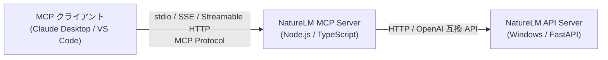
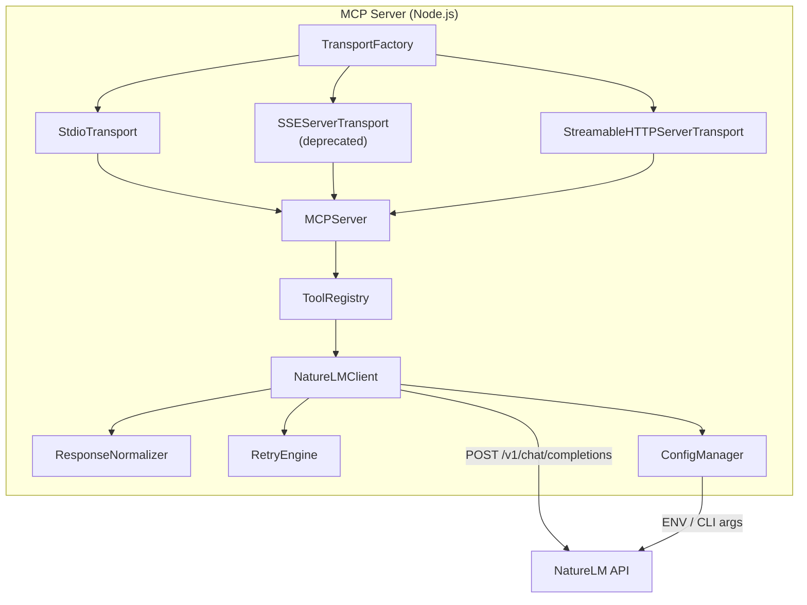
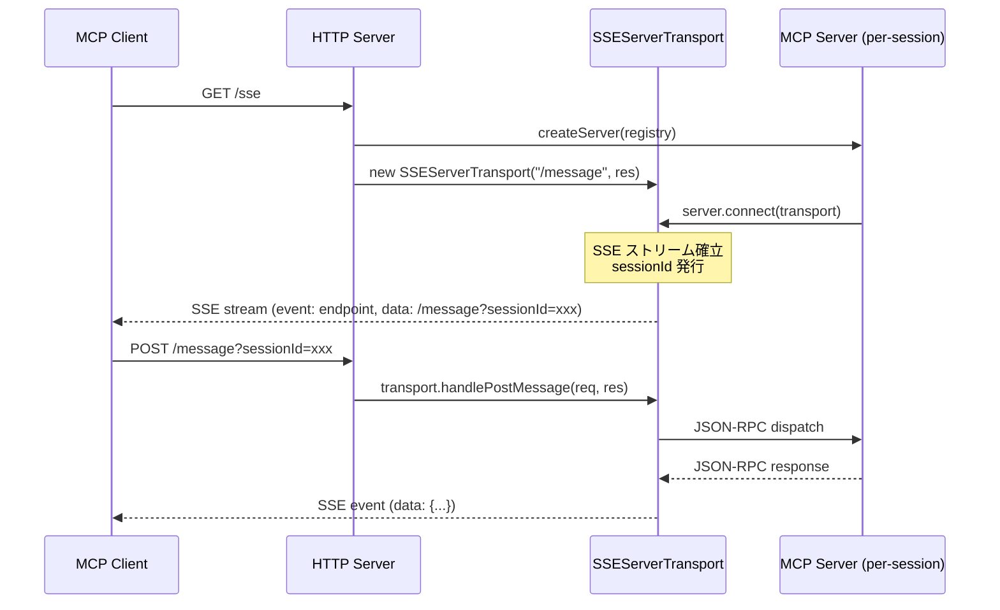

```mermaid
sequenceDiagram
    participant C as MCP Client
    participant H as HTTP Server
    participant T as StreamableHTTPServerTransport (per-session)
    participant S as MCP Server (per-session)

    C->>H: POST /mcp (initialize)
    H->>S: createServer(registry)
    H->>T: new StreamableHTTPServerTransport(...)
    S->>T: server.connect(transport)
    T->>S: JSON-RPC initialize
    S-->>T: initialize response
    Note over T: onsessioninitialized → sessions.set()
    T-->>C: 200 OK + mcp-session-id header

    C->>H: POST /mcp + mcp-session-id header
    H->>T: sessions.get(id) → transport.handleRequest(req, res)
    T->>S: JSON-RPC request
    S-->>T: JSON-RPC response
    T-->>C: SSE stream / JSON response

    C->>H: GET /mcp + mcp-session-id header
    H->>T: transport.handleRequest(req, res)
    T-->>C: SSE stream (server notifications)

    C->>H: DELETE /mcp + mcp-session-id header
    H->>T: transport.handleRequest(req, res)
    Note over T: onclose → sessions.delete()
    T-->>C: 200 OK (session terminated)
```

# NatureLM MCP Server 設計書

| メタデータ | 値 |
|-----------|-----|
| **ドキュメントID** | DES-NATURELM-MCP-001 |
| **バージョン** | 1.5.0 |
| **ステータス** | Approved |
| **作成日** | 2026-04-06 |
| **作成者** | GitHub Copilot |
| **要件定義書** | REQ-NATURELM-MCP-001 v1.4.0 (Approved) |

---

## 1. アーキテクチャ概要

### 1.1 システムコンテキスト (C4 Level 1)



### 1.2 コンテナ図 (C4 Level 2)



### 1.3 設計原則

| 原則 | 適用 |
|------|------|
| 単一責任 (SRP) | 各モジュールは1つの責務のみ担う |
| 依存性逆転 (DIP) | NatureLMClient はインターフェース経由で外部 API に依存 |
| 開放閉鎖 (OCP) | 新しい MCP ツールの追加は ToolRegistry への登録のみ |

---

## 2. コンポーネント設計

### DES-NLM-001: SMILES 生成ツール

**トレーサビリティ**: REQ-NLM-001

**ツール定義**:
```typescript
{
  name: "generate_smiles",
  description: "Generate SMILES notation for a molecule by name or desired properties",
  inputSchema: {
    type: "object",
    properties: {
      query: {
        type: "string",
        description: "Molecule name (e.g. 'caffeine') or desired properties (e.g. 'molecule with 4 hydrogen bond donors')"
      },
      temperature: { type: "number", default: 0.7 },
      max_retries: { type: "integer", default: 5 }
    },
    required: ["query"]
  }
}
```

**処理フロー**:
1. `query` を受け取り、NatureLMClient へ推論リクエスト送信
2. プロンプト例: `"What is the SMILES notation for {query}?"`
3. ResponseNormalizer で `<mol>...</mol>` タグを抽出し SMILES を返却
4. 空出力時は RetryEngine で再試行

---

### DES-NLM-002: SMILES 検証ツール

**トレーサビリティ**: REQ-NLM-002

**ツール定義**:
```typescript
{
  name: "validate_smiles",
  description: "[Experimental] Validate a SMILES string using NatureLM",
  inputSchema: {
    type: "object",
    properties: {
      smiles: { type: "string", description: "SMILES string to validate" }
    },
    required: ["smiles"]
  }
}
```

**処理フロー**:
1. プロンプト: `"Is the following SMILES valid? {smiles}"`
2. NatureLM 応答をパースし、valid/invalid を判定
3. 結果に「参考値。確定的検証にはRDKit等を使用してください」の注釈を付与

---

### DES-NLM-003: logP 予測ツール

**トレーサビリティ**: REQ-NLM-003

**ツール定義**:
```typescript
{
  name: "predict_logp",
  description: "Predict the logP value of a molecule from its SMILES",
  inputSchema: {
    type: "object",
    properties: {
      smiles: { type: "string", description: "SMILES notation of the molecule" }
    },
    required: ["smiles"]
  }
}
```

**処理フロー**:
1. プロンプト: `"Predict the logP value of the molecule {smiles}"`
2. 応答から数値を抽出（正規表現: `/-?\d+\.?\d*/`）
3. 数値と単位 "logP" を構造化して返却

---

### DES-NLM-004: 分子量予測ツール

**トレーサビリティ**: REQ-NLM-004

**ツール定義**:
```typescript
{
  name: "predict_molecular_weight",
  description: "Predict the molecular weight of a molecule from its SMILES (AI prediction, use as reference)",
  inputSchema: {
    type: "object",
    properties: {
      smiles: { type: "string", description: "SMILES notation of the molecule" }
    },
    required: ["smiles"]
  }
}
```

**処理フロー**:
1. プロンプト: `"Predict the molecular weight of the molecule {smiles}"`
2. 応答から数値を抽出
3. 「AI予測値であり参考値」の注釈を付与して返却

---

### DES-NLM-005: 汎用物性予測ツール

**トレーサビリティ**: REQ-NLM-005

**ツール定義**:
```typescript
{
  name: "predict_property",
  description: "Predict a molecular property from SMILES",
  inputSchema: {
    type: "object",
    properties: {
      smiles: { type: "string", description: "SMILES notation" },
      property_name: { type: "string", description: "Property to predict (e.g. 'solubility', 'boiling_point')" }
    },
    required: ["smiles", "property_name"]
  }
}
```

**処理フロー**:
1. プロンプト: `"Predict the {property_name} of the molecule {smiles}"`
2. ツールハンドラでサポート対象物性の allowlist を確認する
3. 未対応の物性名の場合は `"サポートされていない物性です: {property_name}"` を返却する
4. 対応物性の場合は NatureLM 応答を返却する（物性ごとに形式が異なるため）

---

### DES-NLM-006: 逆合成分析ツール

**トレーサビリティ**: REQ-NLM-006

**ツール定義**:
```typescript
{
  name: "retrosynthesis",
  description: "[Experimental] Propose retrosynthesis routes for a target molecule",
  inputSchema: {
    type: "object",
    properties: {
      smiles: { type: "string", description: "Target molecule SMILES" },
      max_retries: { type: "integer", default: 5 }
    },
    required: ["smiles"]
  }
}
```

**処理フロー**:
1. プロンプト: `"Perform retrosynthesis on the molecule {smiles}"`
2. 空出力時は RetryEngine で自動リトライ（REQ-NLM-016 準拠）
3. 応答から前駆体 SMILES を抽出

---

### DES-NLM-007: タンパク質配列生成ツール

**トレーサビリティ**: REQ-NLM-007

**ツール定義**:
```typescript
{
  name: "generate_protein_sequence",
  description: "[Experimental] Generate a protein sequence for given properties",
  inputSchema: {
    type: "object",
    properties: {
      description: { type: "string", description: "Desired protein properties or function" }
    },
    required: ["description"]
  }
}
```

**処理フロー**:
1. NatureLM に特性を送信
2. `<protein>...</protein>` タグからアミノ酸配列を抽出
3. 「専門家による検証を推奨」の注釈を付与

---

### DES-NLM-008: 材料組成予測ツール

**トレーサビリティ**: REQ-NLM-008

**ツール定義**:
```typescript
{
  name: "predict_material_composition",
  description: "[Experimental] Predict material composition for target properties",
  inputSchema: {
    type: "object",
    properties: {
      description: { type: "string", description: "Target material properties" }
    },
    required: ["description"]
  }
}
```

**処理フロー**:
1. NatureLM に特性を送信
2. `<material>...</material>` タグから組成を抽出
3. 「専門家による検証を推奨」の注釈を付与

---

### DES-NLM-009: 自由形式クエリツール

**トレーサビリティ**: REQ-NLM-009

**ツール定義**:
```typescript
{
  name: "ask_naturelm",
  description: "Ask NatureLM a free-form scientific question",
  inputSchema: {
    type: "object",
    properties: {
      question: { type: "string", description: "Scientific question in natural language" },
      temperature: { type: "number", default: 0.7 },
      max_tokens: { type: "integer", default: 512 }
    },
    required: ["question"]
  }
}
```

**処理フロー**:
1. `question` をそのまま NatureLMClient に送信
2. 応答を ResponseNormalizer で正規化（科学トークンがあれば整形）
3. 結果をそのまま返却

---

### DES-NLM-010: モデル情報取得ツール

**トレーサビリティ**: REQ-NLM-010

**ツール定義**:
```typescript
{
  name: "get_model_info",
  description: "Get NatureLM model information and capabilities",
  inputSchema: { type: "object", properties: {} }
}
```

**処理フロー**:
1. NatureLMClient 経由で `GET /models` を呼び出し
2. モデル名、ケイパビリティを構造化して返却

---

## 3. 内部コンポーネント設計

### DES-NLM-011: ConfigManager

**トレーサビリティ**: REQ-NLM-011, REQ-NLM-013, REQ-NLM-020, REQ-NLM-021

```typescript
interface NatureLMConfig {
  baseUrl: string;      // NATURELM_BASE_URL | --api-url   default: "http://localhost:8080/v1"
  apiKey: string;       // NATURELM_API_KEY  | --api-key   default: "unused"
  model: string;        // NATURELM_MODEL    | --model     default: "naturelm-8x7b-inst"
  timeout: number;      // NATURELM_TIMEOUT                default: 120000 (ms)
}
```

**優先順位**: CLI引数 > 環境変数 > デフォルト値

**セキュリティ**: `apiKey` はログ出力時にマスクする（先頭4文字 + `****`）

---

### DES-NLM-012: NatureLMClient — 接続・エラーハンドリング

**トレーサビリティ**: REQ-NLM-012, REQ-NLM-019

```typescript
interface INatureLMClient {
  chat(messages: ChatMessage[], options?: ChatOptions): Promise<string>;
  listModels(): Promise<ModelInfo[]>;
  healthCheck(): Promise<boolean>;
}
```

**戻り値設計**: `chat()` は NatureLM の生テキスト応答 (`string`) を返す。構造化 (`NormalizedResponse`) への変換は呼び出し側が ResponseNormalizer を通して行う。責務分離を維持し、Client は HTTP 通信に専念する。

**接続エラー処理**:
```
リクエスト送信
  ├─ 成功 → 応答返却
  └─ 失敗
      ├─ リトライ対象（一時的障害の可能性）
      │   ├─ ECONNREFUSED → リトライ（最大3回、指数バックオフ: 1s, 2s, 4s）
      │   │                  全失敗時: "NatureLM APIに接続できません。サーバーが起動しているか、
      │   │                            ベースURL ({baseUrl}) が正しいか確認してください"
      │   └─ ETIMEDOUT    → リトライ（最大3回、指数バックオフ: 1s, 2s, 4s）
      │                      全失敗時: "NatureLM APIがタイムアウトしました ({timeout}ms)。
      │                                NATURELM_TIMEOUT で調整できます"
      └─ 即時エラー（リトライ無意味）
          ├─ ENOTFOUND    → "ホスト名を解決できません。WSL環境の場合、
          │                   Windows側IPアドレスを NATURELM_BASE_URL に設定してください"
          └─ その他(4xx等) → エラーメッセージをそのまま返却
```

---

### DES-NLM-013: NatureLMClient — タイムアウト

**トレーサビリティ**: REQ-NLM-013

- OpenAI クライアントの `timeout` オプションに `config.timeout` を設定
- デフォルト 120,000ms（CPU推論が低速なため）

---

### DES-NLM-014: MCPServer セットアップ

**トレーサビリティ**: REQ-NLM-014

```typescript
import { Server } from "@modelcontextprotocol/sdk/server/index.js";
import { StdioServerTransport } from "@modelcontextprotocol/sdk/server/stdio.js";

const server = new Server({ name: "naturelm-mcp", version: "1.0.0" }, {
  capabilities: { tools: {} }
});

// tools/list — ToolRegistry から全ツール定義を返却
// tools/call — ツール名でディスパッチし実行
```

**拡張対象**: DES-NLM-023〜026 で SSE / Streamable HTTP トランスポートを追加。

**SDK 制約**: `Server.connect(transport)` は 1 インスタンスにつき 1 回しか呼べない（2 回目で例外）。
HTTP 系トランスポートでは接続ごとに新しい Server インスタンスが必要なため、
`createServer(registry)` ファクトリ関数を `transport.ts` に配置し、Server + ハンドラ登録を共通化する。
`index.ts` は ToolRegistry 構築 → `startTransport(registry, config)` 呼び出しに簡素化する。

---

### DES-NLM-015: ToolRegistry — スキーマ管理

**トレーサビリティ**: REQ-NLM-015

```typescript
interface ToolDefinition {
  name: string;
  description: string;
  inputSchema: JSONSchema;
  handler: (args: Record<string, unknown>) => Promise<ToolResult>;
}

class ToolRegistry {
  private tools: Map<string, ToolDefinition>;
  register(tool: ToolDefinition): void;
  list(): ToolDefinition[];
  call(name: string, args: Record<string, unknown>): Promise<ToolResult>;
}
```

全 10 ツール（DES-NLM-001〜010）を起動時に登録。

**実行結果契約**: `ToolResult` は本文に加えて任意の `metadata` を保持できる。空出力リトライを使用したツールは `metadata.attempts` に実試行回数を格納する。

---

### DES-NLM-016: RetryEngine — 空出力リトライ

**トレーサビリティ**: REQ-NLM-016

```typescript
interface RetryOptions {
  maxRetries: number;       // default: 5
  baseTemperature: number;  // default: 0.7
  temperatureStep: number;  // default: 0.15
  maxTemperature: number;   // default: 1.0
}

class RetryEngine {
  async executeWithRetry(
    fn: (temperature: number, seed: number) => Promise<string>,
    options: RetryOptions
  ): Promise<{ result: string; attempts: number }>;
}
```

**アルゴリズム**:
```
attempt = 0
WHILE attempt < maxRetries:
  seed = crypto.randomInt()
  temp = min(baseTemperature + attempt * temperatureStep, maxTemperature)
  result = fn(temp, seed)
  IF result is not empty:
    RETURN { result, attempts: attempt + 1 }
  attempt++
RETURN { result: "生成に失敗しました。より具体的なプロンプトをお試しください", attempts: maxRetries }
```

**メタデータ連携**: `executeWithRetry()` の戻り値 `attempts` は、呼び出し元ツールハンドラが `ToolResult.metadata.attempts` へ転記する。

---

### DES-NLM-017: ResponseNormalizer — 科学トークン抽出

**トレーサビリティ**: REQ-NLM-017, REQ-NLM-022

```typescript
interface NormalizedResponse {
  content: string;       // 正規化済みテキスト
  raw_response: string;  // 元の生応答
  tags_found: string[];  // 検出されたタグ種別
}

class ResponseNormalizer {
  normalize(raw: string): NormalizedResponse;
  extractSmiles(raw: string): string | null;       // <mol>...</mol> → SMILES
  extractProtein(raw: string): string | null;       // <protein>...</protein> → 配列
  extractMaterial(raw: string): string | null;      // <material>...</material> → 組成
}
```

**SMILES 抽出ロジック**:
1. `<mol>...</mol>` タグを正規表現で検出
2. タグ内の `<m>` プレフィックスを全て除去
3. 結合して標準 SMILES 文字列を返却

**設計判断**: REQ-NLM-017（タグ抽出詳細）と REQ-NLM-022（応答正規化全体）は ResponseNormalizer に統合する。`normalize()` がエントリポイントで、内部で各 `extract*` を呼び分ける。タグなしの場合はテキストをそのまま返却。

---

### DES-NLM-018: プロンプトテンプレート

**トレーサビリティ**: REQ-NLM-018

```typescript
class PromptTemplate {
  static wrapForCompletions(input: string): string {
    return `Instruction: ${input}\n\n\nResponse:\n`;
  }
  static stopSequences(): string[] {
    return ["Instruction:", "</s>"];
  }
}
```

**適用条件**: Chat Completions API 利用時（既定）はテンプレート不要。Completions API にフォールバックする構成でのみ使用。NatureLMClient 内部で API 種別に応じて自動判定。

---

### DES-NLM-019: NatureLMClient — Chat Completions

**トレーサビリティ**: REQ-NLM-019

```typescript
import OpenAI from "openai";

class NatureLMClient implements INatureLMClient {
  private client: OpenAI;
  private config: NatureLMConfig;

  constructor(config: NatureLMConfig) {
    this.config = config;
    this.client = new OpenAI({
      baseURL: config.baseUrl,
      apiKey: config.apiKey,
      timeout: config.timeout,
    });
  }

  async chat(messages: ChatMessage[], options?: ChatOptions): Promise<string> {
    const response = await this.client.chat.completions.create({
      model: this.config.model,
      messages,
      temperature: options?.temperature ?? 0.7,
      max_tokens: options?.maxTokens ?? 512,
      seed: options?.seed,
    });
    return response.choices[0]?.message?.content ?? "";
  }
}
```

---

### DES-NLM-020: API キー管理

**トレーサビリティ**: REQ-NLM-020

- ConfigManager が `NATURELM_API_KEY` を読み取り
- 未設定時は `"unused"` を既定値として OpenAI クライアントに渡す
- ログ出力ユーティリティ: `maskApiKey(key)` → `"unus****"` 形式

---

### DES-NLM-021: モデル識別子管理

**トレーサビリティ**: REQ-NLM-021

- 起動時に `healthCheck()` → `listModels()` を呼び出し
- 設定モデル ID がレスポンスに含まれない場合: `console.error` で警告を出力し、起動は継続
- 含まれる場合: 正常起動

---

## 3. マルチトランスポート設計

### DES-NLM-023: トランスポートモード選択

**トレーサビリティ**: REQ-NLM-023

#### 3.1 NatureLMConfig 拡張

```typescript
// types.ts に追加
type TransportMode = "stdio" | "sse" | "http";

interface NatureLMConfig {
  baseUrl: string;
  apiKey: string;
  model: string;
  timeout: number;
  transport: TransportMode;  // default: "stdio"
  host: string;              // default: "127.0.0.1"
  port: number;              // default: 3000
}
```

#### 3.2 ConfigManager 拡張

```typescript
// config.ts に追加する設定読み取り
const DEFAULTS = {
  // ...既存...
  transport: "stdio" as TransportMode,
  host: "127.0.0.1",
  port: 3000,
};

// ENV layer
// NATURELM_TRANSPORT → config.transport
// NATURELM_HOST → config.host
// NATURELM_PORT → config.port (Number)

// CLI layer
// --transport <stdio|sse|http>
// --host <address>
// --port <number>
```

**バリデーション**: `transport` が `"stdio" | "sse" | "http"` 以外の場合、`console.error` で不正値を出力し `process.exit(1)` で終了する。

#### 3.3 Server ファクトリ（R1/R2/R3 対応）

新規ファイル `src/transport.ts` に配置。

**SDK 制約**: `Protocol.connect(transport)` は `if (this._transport) throw new Error(...)` により
1 Server インスタンスにつき 1 Transport しか接続できない。
SSE / Streamable HTTP では接続ごとに Server + Transport のペアを生成する必要がある。

```typescript
import { Server } from "@modelcontextprotocol/sdk/server/index.js";
import {
  ListToolsRequestSchema,
  CallToolRequestSchema,
} from "@modelcontextprotocol/sdk/types.js";
import type { ToolRegistry } from "./tools/registry.js";

/**
 * Server インスタンスを生成し、ToolRegistry のハンドラを登録する。
 * HTTP 系トランスポートでは接続毎にこの関数を呼ぶ。
 */
function createServer(registry: ToolRegistry): Server {
  const server = new Server(
    { name: "naturelm-mcp", version: "1.0.0" },
    { capabilities: { tools: {} } },
  );

  server.setRequestHandler(ListToolsRequestSchema, async () => ({
    tools: registry.list().map((t) => ({
      name: t.name,
      description: t.description,
      inputSchema: t.inputSchema,
    })),
  }));

  server.setRequestHandler(CallToolRequestSchema, async (request) => {
    const { name, arguments: args } = request.params;
    const result = await registry.call(name, args ?? {});
    return { content: result.content, isError: result.isError };
  });

  return server;
}
```

#### 3.4 startTransport エントリポイント

```typescript
/**
 * トランスポートモードに応じた起動処理を実行する。
 * ToolRegistry を受け取り、内部で Server を生成する。
 */
export async function startTransport(
  registry: ToolRegistry,
  config: NatureLMConfig
): Promise<void>;
```

**選択ロジック**:
```
config.transport
  ├── "stdio" → startStdioTransport(registry)
  ├── "sse"   → startSSETransport(registry, config)
  └── "http"  → startStreamableHTTPTransport(registry, config)
```

- `stdio`: Server を 1 つ生成し StdioServerTransport に接続（1:1）
- `sse` / `http`: 接続ごとに `createServer(registry)` で新 Server を生成（1:N）

#### 3.5 index.ts 責務変更（R5 対応）

```typescript
// index.ts（リファクタ後）
async function main(): Promise<void> {
  const config = ConfigManager.load(process.argv.slice(2));
  const client = new NatureLMClient(config);

  // ToolRegistry 構築（既存と同じ）
  const registry = new ToolRegistry();
  registry.register(createGenerateSmilesTool(client));
  // ... 全 10 ツール登録 ...

  // 起動時 healthCheck + モデル検証（既存と同じ）
  // ...

  // トランスポート起動（Server 生成は transport.ts に委譲）
  await startTransport(registry, config);
}
```

**変更点**: `index.ts` は Server インスタンスを直接生成しない。
ToolRegistry の構築と healthCheck のみを担い、Server + Transport の接続は `startTransport()` に委譲する。

---

### DES-NLM-024: SSE トランスポート

**トレーサビリティ**: REQ-NLM-024
**注記**: SDK の `SSEServerTransport` は deprecated。レガシー互換のため提供する。

#### アーキテクチャ



#### 実装設計

```typescript
import http from "node:http";
import { SSEServerTransport } from "@modelcontextprotocol/sdk/server/sse.js";

async function startSSETransport(
  registry: ToolRegistry,
  config: NatureLMConfig
): Promise<void> {
  // セッション管理: sessionId → SSEServerTransport
  const sessions = new Map<string, SSEServerTransport>();

  const httpServer = http.createServer(async (req, res) => {
    const url = new URL(req.url!, `http://${req.headers.host}`);

    if (req.method === "GET" && url.pathname === "/sse") {
      // セッション毎に Server + Transport ペアを生成（R1 対応）
      const server = createServer(registry);
      const transport = new SSEServerTransport("/message", res);
      sessions.set(transport.sessionId, transport);
      
      // クライアント切断時にセッション除去 + Server クローズ
      res.on("close", () => {
        sessions.delete(transport.sessionId);
        server.close().catch(() => {});
      });
      
      await server.connect(transport);
      return;
    }

    if (req.method === "POST" && url.pathname === "/message") {
      const sessionId = url.searchParams.get("sessionId");
      const transport = sessionId ? sessions.get(sessionId) : undefined;
      if (!transport) {
        res.writeHead(400, { "Content-Type": "application/json" });
        res.end(JSON.stringify({ error: "Invalid or missing sessionId" }));
        return;
      }
      await transport.handlePostMessage(req, res);
      return;
    }

    // 未知のパス
    res.writeHead(404);
    res.end("Not Found");
  });

  setupGracefulShutdown(httpServer, sessions);

  httpServer.listen(config.port, config.host, () => {
    console.error(
      `NatureLM MCP Server (SSE) listening on http://${config.host}:${config.port}/sse`
    );
  });
}
```

**セッション管理**（R1 修正）:
- `GET /sse` 毎に `createServer(registry)` で新しい Server インスタンスを生成する（SDK の `connect()` は 1 Server につき 1 回のみ）
- `SSEServerTransport` も同時に生成し、`server.connect(transport)` でペアリングする
- `sessions` Map で `sessionId → transport` を保持する
- クライアント切断（`res.on("close")`）時に Map から除去し、`server.close()` を呼ぶ
- `POST /message` は `sessionId` クエリパラメータで対応する transport にルーティングする
- `sessionId` は SDK の getter が `string`（non-optional）を返すため non-null assertion 不要（R6 対応）

---

### DES-NLM-025: Streamable HTTP トランスポート

**トレーサビリティ**: REQ-NLM-025

#### アーキテクチャ



#### 実装設計

```typescript
import http from "node:http";
import crypto from "node:crypto";
import { StreamableHTTPServerTransport } from "@modelcontextprotocol/sdk/server/streamableHttp.js";
import { isInitializeRequest } from "@modelcontextprotocol/sdk/types.js";

async function startStreamableHTTPTransport(
  registry: ToolRegistry,
  config: NatureLMConfig
): Promise<void> {
  // セッション管理: sessionId → transport（R2 対応）
  const sessions = new Map<string, StreamableHTTPServerTransport>();

  const httpServer = http.createServer(async (req, res) => {
    const url = new URL(req.url!, `http://${req.headers.host}`);

    if (url.pathname !== "/mcp") {
      res.writeHead(404);
      res.end("Not Found");
      return;
    }

    // 既存セッションへのルーティング
    const sessionId = req.headers["mcp-session-id"] as string | undefined;
    if (sessionId && sessions.has(sessionId)) {
      const transport = sessions.get(sessionId)!;
      await transport.handleRequest(req, res);
      return;
    }

    // 無効なセッション ID は即 404（REQ-NLM-025）
    if (sessionId && !sessions.has(sessionId)) {
      res.writeHead(404, { "Content-Type": "application/json" });
      res.end(JSON.stringify({
        jsonrpc: "2.0",
        error: { code: -32001, message: "Session not found" },
        id: null,
      }));
      return;
    }

    // 初期化判定のため POST body を先読みする
    // initialize リクエストの場合のみ新しい Server + Transport ペアを生成する
    if (req.method === "POST") {
      const rawBody = await readJsonBody(req);
      const messages = Array.isArray(rawBody) ? rawBody : [rawBody];
      const isInitializationRequest = messages.some(isInitializeRequest);

      if (!isInitializationRequest) {
        res.writeHead(400, { "Content-Type": "application/json" });
        res.end(JSON.stringify({
          jsonrpc: "2.0",
          error: { code: -32000, message: "Bad Request: Mcp-Session-Id header is required" },
          id: null,
        }));
        return;
      }

      // 初期化リクエスト: 新しい Server + Transport ペアを生成
      const server = createServer(registry);
      const transport = new StreamableHTTPServerTransport({
        sessionIdGenerator: () => crypto.randomUUID(),
        onsessioninitialized: (id) => {
          sessions.set(id, transport);
        },
      });

      transport.onclose = () => {
        if (transport.sessionId) {
          sessions.delete(transport.sessionId);
        }
      };

      await server.connect(transport);
      await transport.handleRequest(req, res, rawBody);
      return;
    }

    // セッション ID なし or 無効 + GET/DELETE → 400
    res.writeHead(400, { "Content-Type": "application/json" });
    res.end(JSON.stringify({
      jsonrpc: "2.0",
      error: { code: -32000, message: "Bad Request: No valid session" },
      id: null,
    }));
  });

  setupGracefulShutdown(httpServer, sessions);

  httpServer.listen(config.port, config.host, () => {
    console.error(
      `NatureLM MCP Server (Streamable HTTP) listening on http://${config.host}:${config.port}/mcp`
    );
  });
}
```

**Stateful mode 動作**（R2 修正）:
- `mcp-session-id` ヘッダが存在し、Map に一致する場合のみ既存セッションへルーティングする
- `mcp-session-id` ヘッダが存在するが Map に存在しない場合は 404 Not Found を返す
- POST body を先読みし、`isInitializeRequest` で initialize を判定する
- 初期化リクエスト毎に `createServer(registry)` + `new StreamableHTTPServerTransport()` のペアを生成する
- `onsessioninitialized` コールバックで `sessions` Map にセッション ID → transport を登録する
- 以降のリクエストは `mcp-session-id` ヘッダで対応する transport にルーティングする
- `transport.onclose` で Map からセッションを除去する
- セッション ID なしの非初期化リクエストは 400 Bad Request を返す
- `sessionIdGenerator: () => crypto.randomUUID()` で stateful mode 動作

**初期化判定方針**: 新規セッション生成は initialize POST に限定する。HTTP サーバー層で body を JSON として読み取り、`isInitializeRequest` で初期化メッセージかを判定してから transport を生成する。

**SDK 委譲方針**: セッション内のメソッド判別・プロトコル検証・正常系レスポンスは `handleRequest()` に委譲する。セッション間のルーティングと initialize 前判定のみ自前で行う。

---

### DES-NLM-026: HTTP バインド設定

**トレーサビリティ**: REQ-NLM-026

DES-NLM-023 の NatureLMConfig 拡張に含まれる `host` / `port` フィールドで実現する。

| 設定項目 | ENV | CLI | デフォルト |
|---------|-----|-----|-----------|
| バインドアドレス | `NATURELM_HOST` | `--host` | `127.0.0.1` |
| ポート番号 | `NATURELM_PORT` | `--port` | `3000` |

- CLI > ENV > デフォルト の優先順位（既存の ConfigManager パターンを踏襲）
- `stdio` モード時は `host` / `port` は無視される（使用しない）

---

### DES-NLM-027: グレースフルシャットダウン（R7 対応）

SSE / Streamable HTTP モードでは HTTP サーバーのシャットダウンが必要。

```typescript
function setupGracefulShutdown(
  httpServer: http.Server,
  sessions: Map<string, { close(): Promise<void> }>
): void {
  const shutdown = async () => {
    console.error("Shutting down...");
    // 全セッションをクローズ
    for (const [id, transport] of sessions) {
      await transport.close().catch(() => {});
      sessions.delete(id);
    }
    httpServer.close();
  };
  process.on("SIGINT", shutdown);
  process.on("SIGTERM", shutdown);
}
```

- `SIGINT`（Ctrl+C）/ `SIGTERM` で全セッションの transport をクローズし、HTTP サーバーを停止する
- `stdio` モードでは不要（SDK + プロセス終了で自動クリーンアップ）

---

## 4. ファイル構成

```
naturelm-mcp/
├── src/
│   ├── index.ts                 # エントリポイント: Server 起動
│   ├── config.ts                # ConfigManager
│   ├── client.ts                # NatureLMClient (INatureLMClient)
│   ├── transport.ts             # TransportFactory (DES-NLM-023〜026)
│   ├── retry.ts                 # RetryEngine
│   ├── normalizer.ts            # ResponseNormalizer
│   ├── prompt-template.ts       # PromptTemplate
│   ├── tools/
│   │   ├── registry.ts          # ToolRegistry
│   │   ├── generate-smiles.ts   # DES-NLM-001
│   │   ├── validate-smiles.ts   # DES-NLM-002
│   │   ├── predict-logp.ts      # DES-NLM-003
│   │   ├── predict-mw.ts        # DES-NLM-004
│   │   ├── predict-property.ts  # DES-NLM-005
│   │   ├── retrosynthesis.ts    # DES-NLM-006
│   │   ├── generate-protein.ts  # DES-NLM-007
│   │   ├── predict-material.ts  # DES-NLM-008
│   │   ├── ask-naturelm.ts      # DES-NLM-009
│   │   └── model-info.ts        # DES-NLM-010
│   └── types.ts                 # 共通型定義
├── tests/
│   ├── config.test.ts
│   ├── client.test.ts
│   ├── retry.test.ts
│   ├── normalizer.test.ts
│   ├── transport.test.ts        # DES-NLM-023〜026 テスト
│   └── tools/
│       ├── generate-smiles.test.ts
│       └── ...
├── package.json
├── tsconfig.json
└── docs/
    ├── REQ-NATURELM-MCP-001.md
    └── DES-NATURELM-MCP-001.md
```

---

## 5. 共通型定義（types.ts）

```typescript
/** トランスポートモード */
type TransportMode = "stdio" | "sse" | "http";

/** NatureLM MCP Server 設定 */
interface NatureLMConfig {
  baseUrl: string;        // NatureLM API base URL
  apiKey: string;         // API key
  model: string;          // model identifier
  timeout: number;        // request timeout (ms)
  transport: TransportMode; // transport mode (default: "stdio")
  host: string;           // HTTP bind address (default: "127.0.0.1")
  port: number;           // HTTP bind port (default: 3000)
}

/** NatureLM API へ送信するメッセージ */
interface ChatMessage {
  role: "system" | "user" | "assistant";
  content: string;
}

/** chat() のオプションパラメータ */
interface ChatOptions {
  temperature?: number;   // default: 0.7
  maxTokens?: number;     // default: 512
  seed?: number;          // RetryEngine がリトライ毎に変更
}

/** /models エンドポイントから取得するモデル情報 */
interface ModelInfo {
  id: string;
  object: string;
  owned_by: string;
}

/** MCP ツールの実行結果 */
interface ToolResult {
  content: Array<{ type: "text"; text: string }>;
  metadata?: {
    attempts?: number;
    raw_response?: string;
    tags_found?: string[];
  };
  isError?: boolean;
}

/** JSON Schema のサブセット（ツール inputSchema 用） */
type JSONSchema = Record<string, unknown>;
```

---

## 6. リトライ戦略の整理（レビュー指摘 R2 対応）

| 種別 | 対象 | 最大回数 | 戦略 | 適用層 |
|------|------|---------|------|--------|
| 接続リトライ | ECONNREFUSED, ETIMEDOUT | 3回 | 指数バックオフ (1s, 2s, 4s) | NatureLMClient |
| 即時エラー | ENOTFOUND, 4xx 等 | 0回 | 即時返却（リトライ無意味） | NatureLMClient |
| 空出力リトライ | 空文字列応答 (EOS 即出力) | 5回 | シード変更 + 温度昇温 | RetryEngine |

**合計上限**: 接続リトライは HTTP レイヤーで完結し、空出力リトライはアプリケーションレイヤーで動作する。最悪ケースでは 1 回の空出力リトライにつき最大 3 回の接続リトライが発生し、合計 15 回の HTTP リクエストとなる。タイムアウト 120s × 15 = 最大 30 分は許容範囲外のため、**空出力リトライ中の接続エラーは即時エラー返却（接続リトライしない）** とする。

**リトライ対象の判定基準**: ECONNREFUSED（サーバー未起動・再起動中）と ETIMEDOUT（ネットワーク遅延）は一時的障害の可能性があるためリトライ対象。ENOTFOUND（DNS解決不可）は設定誤りであり、リトライしても解消しないため即時エラー。

---

## 7. 用語集追記（レビュー指摘 R4 対応）

| 用語 | 定義 |
|------|------|
| **EOS** | End of Sequence。生成終了を示す特殊トークン |
| **GGUF** | GPT-Generated Unified Format。量子化モデルのバイナリ形式 |
| **Mixtral** | Mistral AI の Mixture of Experts アーキテクチャ |
| **stdio** | 標準入出力。MCP サーバーのデフォルトトランスポート |
| **SSE** | Server-Sent Events。HTTP 上の一方向リアルタイムストリーミング。MCP SDK では deprecated |
| **Streamable HTTP** | MCP SDK の推奨 HTTP トランスポート。POST/GET/DELETE でセッション管理 |

---

## 8. 変更履歴

| バージョン | 日付 | 変更者 | 変更内容 |
|-----------|------|--------|----------|
| 1.0.0 | 2026-04-06 | GitHub Copilot | 初版作成。REQ-NATURELM-MCP-001 v1.3.0 の全 22 要件に対応する設計仕様を定義 |
| 1.1.0 | 2026-04-06 | GitHub Copilot | レビュー指摘 D1〜D4 修正: 接続リトライ対象の明確化、chat()戻り値型統一(string)、seed パラメータ追加、共通型定義(§5)追加 |
| 1.2.0 | 2026-04-06 | GitHub Copilot | 再レビュー指摘修正: NatureLMClient の config 保持追加、ToolResult.metadata と attempts 連携を明記、未対応物性のエラー返却方針を追加 |
| 1.3.0 | 2026-04-06 | GitHub Copilot | 承認。ステータスを Approved に変更 |
| 1.4.0 | 2026-04-06 | GitHub Copilot | DES-NLM-023〜026 追加: マルチトランスポート（SSE / Streamable HTTP）設計。C4 ダイアグラム更新、types.ts 拡張、transport.ts 新規追加 |
| 1.4.1 | 2026-04-06 | GitHub Copilot | レビュー指摘 R1〜R7 修正: createServer ファクトリ追加、SSE/Streamable HTTP をセッション毎 Server 生成に変更、index.ts 責務設計追加、graceful shutdown 追加、命名統一、sessionId! 除去 |
| 1.4.2 | 2026-04-06 | GitHub Copilot | 再レビュー指摘修正: Streamable HTTP で initialize POST のみ新規セッション生成、未知 session ID は 404、初期化判定の前処理を明記 |
| 1.5.0 | 2026-04-06 | GitHub Copilot | レビュー PASS。ステータスを Approved に変更 |

---

## 9. 承認

| 役割 | 名前 | 日付 | 署名 |
|------|------|------|------|
| プロダクトオーナー | nahisaho | 2026-04-06 | ✅ |
| 技術リード | nahisaho | 2026-04-06 | ✅ |
