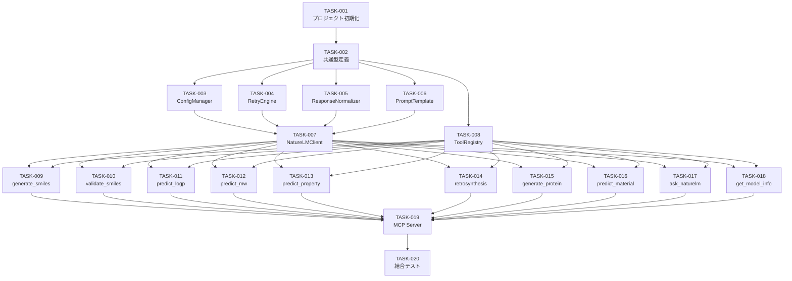

# NatureLM MCP Server 実装計画

| メタデータ | 値 |
|-----------|-----|
| **ドキュメントID** | PLAN-NATURELM-MCP-001 |
| **バージョン** | 1.2.0 |
| **ステータス** | Approved |
| **作成日** | 2026-04-06 |
| **作成者** | GitHub Copilot |
| **要件定義書** | REQ-NATURELM-MCP-001 v1.3.0 (Approved) |
| **設計書** | DES-NATURELM-MCP-001 v1.3.0 (Approved) |

---

## 1. タスク一覧

### Phase A: プロジェクト基盤（依存なし）

#### TASK-001: プロジェクト初期化

**対応設計**: DES-NLM-014（ファイル構成）
**作業内容**:
- `package.json` 作成（name: `naturelm-mcp`, type: module, ESM）
- `tsconfig.json` 作成（target: ES2022, module: Node16）
- 依存パッケージ定義: `@modelcontextprotocol/sdk`, `openai`
- 開発依存: `typescript`, `vitest`, `@types/node`
- `src/` ディレクトリ構造作成

**受入基準**:
- [ ] `npm install` が成功する
- [ ] `npx tsc --noEmit` がエラーなしで通る

**見積もり**: S

---

#### TASK-002: 共通型定義

**対応設計**: DES-NLM-011〜022（§5 共通型定義）
**依存**: TASK-001
**作業内容**:
- `src/types.ts` に `ChatMessage`, `ChatOptions`, `ModelInfo`, `ToolResult`, `JSONSchema`, `NatureLMConfig`, `NormalizedResponse` を定義
- export 文の整備

**受入基準**:
- [ ] 全型が他モジュールから import 可能
- [ ] `tsc --noEmit` パス

**見積もり**: S

---

### Phase B: コア基盤（Phase A 完了後）

#### TASK-003: ConfigManager 実装

**対応設計**: DES-NLM-011
**依存**: TASK-002
**作業内容**:
- `src/config.ts` に ConfigManager を実装
- 環境変数読み取り: `NATURELM_BASE_URL`, `NATURELM_API_KEY`, `NATURELM_MODEL`, `NATURELM_TIMEOUT`
- CLI引数パース（process.argv 簡易実装）
- 優先順位: CLI > ENV > デフォルト
- `maskApiKey()` ユーティリティ

**テスト** (`tests/config.test.ts`):
- [ ] デフォルト値が正しく設定される
- [ ] 環境変数が反映される
- [ ] CLI引数が環境変数より優先される
- [ ] `maskApiKey` が先頭4文字 + `****` を返す

**見積もり**: M

---

#### TASK-004: RetryEngine 実装

**対応設計**: DES-NLM-016
**依存**: TASK-002
**作業内容**:
- `src/retry.ts` に RetryEngine を実装
- `executeWithRetry(fn, options)` メソッド
- シード変更 (`crypto.randomInt`)、温度昇温ロジック
- 戻り値に `attempts` を含める

**テスト** (`tests/retry.test.ts`):
- [ ] 初回成功時は attempts=1 を返す
- [ ] 空文字列応答でリトライし、2回目で成功した場合 attempts=2
- [ ] 温度が maxTemperature を超えないことを確認
- [ ] 全リトライ失敗時にエラーメッセージを返す
- [ ] maxRetries=0 で即座にエラーを返す

**見積もり**: M

---

#### TASK-005: ResponseNormalizer 実装

**対応設計**: DES-NLM-017
**依存**: TASK-002
**作業内容**:
- `src/normalizer.ts` に ResponseNormalizer を実装
- `normalize()`, `extractSmiles()`, `extractProtein()`, `extractMaterial()`
- `<mol>` タグ内の `<m>` プレフィックス除去
- タグなしの場合は content にそのまま設定

**テスト** (`tests/normalizer.test.ts`):
- [ ] `<mol><m>C<m>C<m>O</mol>` → `"CCO"` を抽出
- [ ] `<protein>MKTL...</protein>` → 配列を抽出
- [ ] `<material>Fe2O3</material>` → 組成を抽出
- [ ] タグなしテキストはそのまま返却
- [ ] `raw_response` に元テキストを保持
- [ ] `tags_found` に検出されたタグ種別を含む

**見積もり**: M

---

#### TASK-006: PromptTemplate 実装

**対応設計**: DES-NLM-018
**依存**: TASK-002
**作業内容**:
- `src/prompt-template.ts` に PromptTemplate を実装
- `wrapForCompletions()`, `stopSequences()`
- Chat Completions API 利用時（既定）は適用しない設計

**テスト** (`tests/prompt-template.test.ts`):
- [ ] `wrapForCompletions` が正しいフォーマットを返す
- [ ] `stopSequences` が `["Instruction:", "</s>"]` を返す

**見積もり**: S

---

#### TASK-008: ToolRegistry 実装

**対応設計**: DES-NLM-015
**依存**: TASK-002
**作業内容**:
- `src/tools/registry.ts` に ToolRegistry を実装
- `register()`, `list()`, `call()` メソッド
- 未登録ツール呼び出し時のエラーハンドリング

**テスト** (`tests/tools/registry.test.ts`):
- [ ] ツール登録と一覧取得
- [ ] ツール呼び出しが handler を実行
- [ ] 未登録ツール名でエラーを返す

**見積もり**: S

---

### Phase C: クライアント（Phase B 完了後）

#### TASK-007: NatureLMClient 実装

**対応設計**: DES-NLM-012, DES-NLM-013, DES-NLM-019, DES-NLM-020, DES-NLM-021
**依存**: TASK-003, TASK-004, TASK-005, TASK-006
**作業内容**:
- `src/client.ts` に NatureLMClient（INatureLMClient 実装）
- OpenAI クライアント初期化（baseURL, apiKey, timeout）
- `chat()`: Chat Completions API 呼び出し、seed 対応
- `listModels()`: GET /models 呼び出し
- `healthCheck()`: listModels で接続確認
- 接続エラー分類: ECONNREFUSED/ETIMEDOUT → リトライ、ENOTFOUND → 即時エラー
- 空出力リトライ中の接続エラーは即時エラー

**実装メモ**: 接続リトライ（ECONNREFUSED/ETIMEDOUT の指数バックオフ）は `retryConnection()` ヘルパー関数として切り出し、単体テスト可能にする。

**テスト** (`tests/client.test.ts`):
- [ ] 正常応答時に文字列を返す（モック使用）
- [ ] ECONNREFUSED でリトライ後エラーメッセージを返す
- [ ] ENOTFOUND で即時エラーメッセージを返す
- [ ] ETIMEDOUT でリトライ後エラーメッセージを返す
- [ ] healthCheck が true/false を返す
- [ ] listModels がモデル一覧を返す

**見積もり**: L

---

### Phase D: ツール実装（Phase C 完了後）

#### TASK-009: generate_smiles ツール

**対応設計**: DES-NLM-001
**依存**: TASK-007, TASK-008
**作業内容**:
- `src/tools/generate-smiles.ts`
- プロンプト構築、NatureLMClient 呼び出し、ResponseNormalizer で SMILES 抽出
- RetryEngine 連携、metadata.attempts 転記

**テスト**:
- [ ] 正常応答から SMILES を抽出して返却
- [ ] 空出力時にリトライが発動
- [ ] metadata.attempts が設定される

**見積もり**: M

---

#### TASK-010: validate_smiles ツール

**対応設計**: DES-NLM-002
**依存**: TASK-007, TASK-008
**作業内容**:
- `src/tools/validate-smiles.ts`
- 応答パースによる valid/invalid 判定
- 参考値注釈の付与

**テスト**:
- [ ] valid 応答で true 相当を返す
- [ ] invalid 応答で false + 理由を返す
- [ ] 注釈が含まれる

**見積もり**: S

---

#### TASK-011: predict_logp ツール

**対応設計**: DES-NLM-003
**依存**: TASK-007, TASK-008
**作業内容**:
- `src/tools/predict-logp.ts`
- 応答から数値抽出（正規表現）
- 構造化返却

**テスト**:
- [ ] 数値が正しく抽出される
- [ ] 数値なし応答でエラーを返す

**見積もり**: S

---

#### TASK-012: predict_molecular_weight ツール

**対応設計**: DES-NLM-004
**依存**: TASK-007, TASK-008
**作業内容**:
- `src/tools/predict-mw.ts`
- 応答から数値抽出、参考値注釈の付与

**テスト**:
- [ ] 数値が正しく抽出される
- [ ] 参考値注釈が含まれる

**見積もり**: S

---

#### TASK-013: predict_property ツール

**対応設計**: DES-NLM-005
**依存**: TASK-007, TASK-008
**作業内容**:
- `src/tools/predict-property.ts`
- allowlist によるサポート対象物性の検証
- 未対応物性のエラーメッセージ返却

**テスト**:
- [ ] 対応物性で正常応答を返す
- [ ] 未対応物性でエラーメッセージを返す

**見積もり**: S

---

#### TASK-014: retrosynthesis ツール

**対応設計**: DES-NLM-006
**依存**: TASK-007, TASK-008
**作業内容**:
- `src/tools/retrosynthesis.ts`
- RetryEngine 連携、前駆体 SMILES 抽出

**テスト**:
- [ ] 正常応答から前駆体を抽出
- [ ] 空出力時にリトライが発動
- [ ] metadata.attempts が設定される

**見積もり**: M

---

#### TASK-015: generate_protein_sequence ツール

**対応設計**: DES-NLM-007
**依存**: TASK-007, TASK-008
**作業内容**:
- `src/tools/generate-protein.ts`
- `<protein>` タグ抽出、注釈付与

**テスト**:
- [ ] タグから配列を抽出
- [ ] 注釈が含まれる

**見積もり**: S

---

#### TASK-016: predict_material_composition ツール

**対応設計**: DES-NLM-008
**依存**: TASK-007, TASK-008
**作業内容**:
- `src/tools/predict-material.ts`
- `<material>` タグ抽出、注釈付与

**テスト**:
- [ ] タグから組成を抽出
- [ ] 注釈が含まれる

**見積もり**: S

---

#### TASK-017: ask_naturelm ツール

**対応設計**: DES-NLM-009
**依存**: TASK-007, TASK-008
**作業内容**:
- `src/tools/ask-naturelm.ts`
- 自由形式クエリ送信、ResponseNormalizer で正規化

**テスト**:
- [ ] 応答をそのまま返却
- [ ] 科学トークンを含む応答も正しく返却

**見積もり**: S

---

#### TASK-018: get_model_info ツール

**対応設計**: DES-NLM-010
**依存**: TASK-007, TASK-008
**作業内容**:
- `src/tools/model-info.ts`
- `listModels()` 呼び出し、構造化返却

**テスト**:
- [ ] モデル情報を返却

**見積もり**: S

---

### Phase E: 統合（Phase D 完了後）

#### TASK-019: MCP Server エントリポイント

**対応設計**: DES-NLM-014
**依存**: TASK-007, TASK-008, TASK-009〜018
**作業内容**:
- `src/index.ts`
- Server 初期化、StdioServerTransport 接続
- ToolRegistry に全10ツールを登録
- `tools/list`, `tools/call` ハンドラ
- 起動時 healthCheck + モデル検証（DES-NLM-021）
- `console.error` によるログ出力

**受入基準**:
- [ ] `npx tsx src/index.ts` で MCP サーバーが起動する
- [ ] MCP Inspector で tools/list が全10ツールを返す

**見積もり**: M

---

#### TASK-020: 結合テスト

**対応設計**: 全 DES
**依存**: TASK-019
**作業内容**:
- MCP Inspector または手動 stdio でのE2Eテスト
- 実 NatureLM API への接続テスト（手動）
- 各ツールの動作確認

**受入基準**:
- [ ] 全10ツールが MCP プロトコルで呼び出し可能
- [ ] 接続エラー時に適切なメッセージが返る
- [ ] 空出力リトライが動作する

**見積もり**: L

---

## 2. 依存関係 DAG

## 3. 実行順序（推奨）

| 順序 | タスク | 並列可能 |
|------|--------|---------|
| 1 | TASK-001 | - |
| 2 | TASK-002 | - |
| 3 | TASK-003, TASK-004, TASK-005, TASK-006, TASK-008 | ✅ 並列可 |
| 4 | TASK-007 | - |
| 5 | TASK-009〜018 | ✅ 並列可（10ツール） |
| 6 | TASK-019 | - |
| 7 | TASK-020 | - |

## 4. サマリ

| 項目 | 値 |
|------|-----|
| 総タスク数 | 20 |
| S タスク | 12 |
| M タスク | 6 |
| L タスク | 2 |
| クリティカルパス | T001 → T002 → T003 → T007 → T009 → T019 → T020 |
| テストファイル数 | 最低 8 ファイル |

---

## 5. 変更履歴

| バージョン | 日付 | 変更者 | 変更内容 |
|-----------|------|--------|----------|
| 1.0.0 | 2026-04-06 | GitHub Copilot | 初版作成。DES-NATURELM-MCP-001 v1.3.0 から 20 タスクに分解 |
| 1.1.0 | 2026-04-06 | GitHub Copilot | レビュー指摘 P1〜P3 修正: TASK-008 を Phase B へ移動、PromptTemplate テストファイル独立化、接続リトライヘルパー切り出しメモ追加 |
| 1.2.0 | 2026-04-06 | GitHub Copilot | 承認。ステータスを Approved に変更 |

---

## 6. 承認

| 役割 | 名前 | 日付 | 署名 |
|------|------|------|------|
| プロダクトオーナー | nahisaho | 2026-04-06 | ✅ |
| 技術リード | nahisaho | 2026-04-06 | ✅ |
